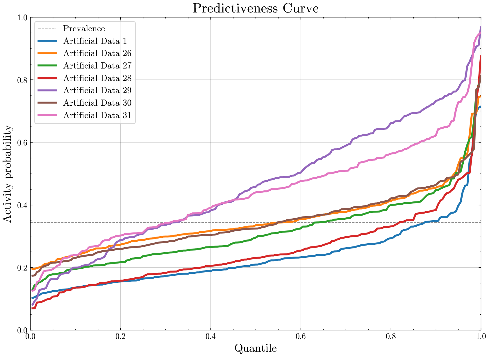
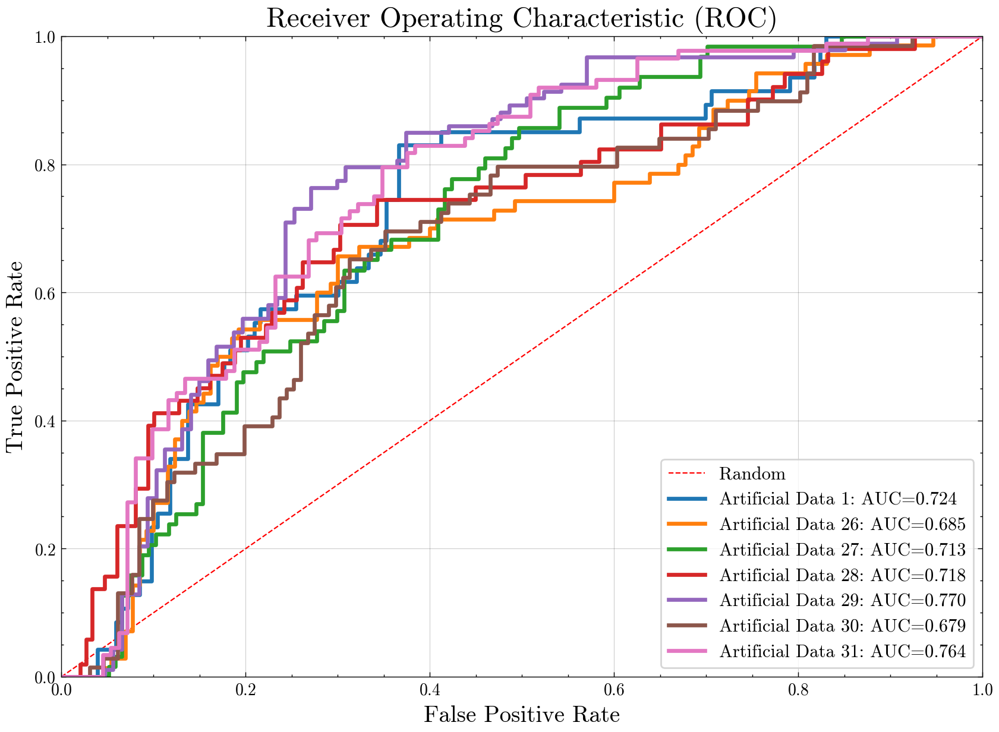

# About PyDockStats

<p align="center">
  
</p>

[](https://github.com/molmodcs/roc-auc-pc/blob/main/LICENSE)

PyDockStats is a versatile and easy-to-use Python tool that builds [ROC](https://en.wikipedia.org/wiki/Receiver_operating_characteristic) (Receiver Operating Characteristic) and [Predictiveness Curve](https://jcheminf.biomedcentral.com/articles/10.1186/s13321-015-0100-8) plots. It also calculates BEDROC and enrichment factor values.

The script starts by creating a logistic regression model from the input data, and with the predictions, it generates graphical plots. The ROC curve visually evaluates the performance of a binary classifier by plotting the true positive rate versus the false positive rate. The Predictiveness Curve (PC) measures the ability of a Virtual Screening program to distinguish true positives (active compounds) from false positives (decoys) through a [Cumulative Distribution Function (CDF)](https://en.wikipedia.org/wiki/Cumulative_distribution_function).

This tool is highly valuable for verifying the performance of Virtual Screening programs and gaining confidence in data-driven inferences.

**The web version of PyDockStats:**
https://pydockstats.streamlit.app/

## Getting Started

The development version can be installed directly from GitHub via `git`:

```bash
git clone https://github.com/molmodcs/PyDockStats.git
```

The source file, "pydockstats.py," generates Predictiveness and ROC curves given a dataset containing decoys, ligands, their IDs, docking scores (decimals separated by dots), and activities (0 or 1). The script is compatible with multiple programs. Input data (.csv, .xlsx, .ods) must include columns for each docking program:

| id_program1 | scores_program1 | activity_program1 | id_program2 | scores_program2 | activity_program2 |
|-------------|-----------------|-------------------|-------------|-----------------|-------------------|
| molecule1   | -12.3          | 0                 | molecule4   | 3.6             | 0                 |

### Example Input:

| surf_id    | surf_scores | surf_actives | icm_id    | icm_scores  | icm_actives | vina_id   | vina_scores | vina_actives |
|------------|-------------|--------------|-----------|-------------|-------------|-----------|-------------|--------------|
| decoy1565  | 16.76       | 0            | decoy428  | -54.926393  | 0           | decoy564  | -13.9       | 0            |
| ligand83   | 16.56       | 1            | decoy564  | -53.988434  | 0           | decoy2783 | -13.8       | 0            |
| ligand82   | 16.56       | 1            | ligand16  | -52.584761  | 1           | decoy298  | -13.7       | 0            |
| ligand13   | 16.42       | 1            | decoy2783 | -52.546666  | 0           | ligand18  | -13.4       | 1            |

Note: The molecules in different programs do not need to be aligned, as the algorithm sorts them independently, discarding alignment.

### Prerequisites

The following libraries are required:

- [matplotlib](https://matplotlib.org/) (3.5.2):
  ```bash
  pip install matplotlib
  ```

- [NumPy](https://numpy.org/) (1.22.3):
  ```bash
  pip install numpy
  ```

- [pandas](https://pandas.pydata.org/) (1.4.2):
  ```bash
  pip install pandas
  ```

- [scikit-learn](https://scikit-learn.org/stable/) (1.1.0):
  ```bash
  pip install scikit-learn
  ```

## Setup

### Using Conda

1. **Install Conda**  
   If you don't already have Conda installed, download and install it from [here](https://docs.conda.io/en/latest/miniconda.html).

2. **Create a New Conda Environment**  
   ```bash
   conda create --name <environment_name> python=<python_version>
   ```
   Replace `<environment_name>` with your desired name for the environment. A suggestion could be PyDockStats, and `<python_version>` with the required Python version (e.g., `3.8`).

3. **Activate the Environment**  
   ```bash
   conda activate PyDockStats
   ```

4. **Install Dependencies**  
   ```bash
   pip install -r requirements.txt
   ```

### Using venv

1. **Create a Virtual Environment**  
   ```bash
   python -m venv <environment_name>
   ```
   Replace `<environment_name>` with your desired name for the environment.

2. **Activate the Virtual Environment**  
   - **Linux/MacOS**:
     ```bash
     source <environment_name>/bin/activate
     ```
   - **Windows**:
     ```bash
     <environment_name>\Scripts\activate
     ```

3. **Install Dependencies**  
   ```bash
   pip install -r requirements.txt
   ```

## Usage

Run the script via the command line where a data_file should follow the example above in a CSV format. 

```bash
python pydockstats.py -f data_file
```

### Optional Arguments:
- `-p` or `--programs`: Names of the programs.
- `-o` or `--output`: Output image filename.

If no optional arguments are specified, the script uses default parameters.

Example:

```bash
python pydockstats.py -f input_data.csv -p gold,vina,dockthor -o out.png
```
where *gold, vina and dockthor* are related to the molecular docking programs used. Please this sequence must be the same to the input data_file.

## Result Plots

The results of the analysis, including ROC and Predictiveness Curve plots, will be saved as image files in the specified output directory. Example of synthetic plots are displayed below:

<p align="center">
  
  
</p>

## Contributing

Please read [CONTRIBUTING.md](https://gist.github.com/PurpleBooth/b24679402957c63ec426) for details on our code of conduct and the process for submitting pull requests.

## Authors

- **Matheus Campos de Mattos** - [GitHub](https://github.com/matheuscamposmtt)
- **Luciano T. Costa** - [Website](http://www.molmodcs.uff.br/) | [GitHub](https://github.com/molmodcs)

See the list of [contributors](https://github.com/molmodcs/roc-auc-pc/blob/3936564b42f2626d41962c3b16ef074d166d8582/contributors) who participated in this project.

## License

This project is licensed under the GNU Lesser General Public License - see the [LICENSE.md](LICENSE.md) file for details.

PyDockStats version 1.0 (746241f), compiled by `matheuscamposmattos@id.uff.br` on 2022-07-25.

## Acknowledgments

This program evaluates and classifies the results from virtual screening. For a deeper understanding of its operation, check the [paper](https://doi.org/10.1186/s13321-015-0100-8) upon which it is based.

## References

Empereur-Mot, C., Guillemain, H., Latouche, A. et al. Predictiveness curves in virtual screening. J Cheminform 7, 52 (2015). https://doi.org/10.1186/s13321-015-0100-8

